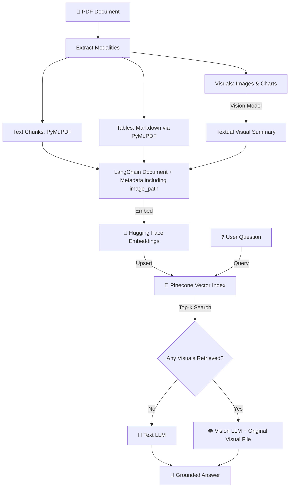

# Multimodal RAG: Chat with Text, Tables, Images & Graphs

A comprehensive guide and lecture notebook for building a **Multimodal Retrieval-Augmented Generation (RAG)** pipeline using **LangChain**, **Pinecone**, **PyMuPDF**, and **Groq (Vision & Text LLMs)**.

👉 **Follow my GitHub Profile:** [CodingWithSanjeet](https://github.com/CodingWithSanjeet)

---

## 📌 1. Overview & The Multimodal Challenge

### The Problem: A Real PDF is Not Just Text
Enterprise documents (financial reports, technical manuals, healthcare records) mix **four main modalities** on the exact same page:

| Modality | Description | Examples |
| :--- | :--- | :--- |
| 📄 **Text** | Narrative explanations, policies, descriptions | Executive summaries, strategic priorities |
| 📊 **Tables** | Structured tabular metrics and KPIs | Financial statements, regional revenue tables |
| 🖼️ **Images** | Facility photos, hardware specs, product photos | Smart assembly plants, product hardware |
| 📈 **Graphs & Diagrams** | Trends, comparisons, process flowcharts | Quarterly revenue line charts, supply chain diagrams |

---

### Why Traditional Text-Only RAG Fails

The classic RAG pipeline extracts raw text while discarding or flattening visual elements:

```text
Traditional RAG:  PDF -> Extract Plain Text (Ignore Visuals) -> Chunk -> Embed -> Retrieve Text Only
```

This traditional approach breaks down on non-text elements:
1. **Charts & Graphs:** The answer is encoded in the chart image (e.g., *"Which quarter had the highest revenue?"*), not in the surrounding text.
2. **Diagrams:** Process flow and critical control points live inside box-and-arrow diagrams (e.g., *"Where is the critical quality-control point?"*).
3. **Structured Tables:** Flattening tables into plain strings strips away row-and-column alignment, leading to hallucinated numbers.

---

## 💡 2. The Multimodal Solution & Architecture

### The Key Idea
> **"Convert every useful modality into a searchable representation (text vector), store it with reference metadata, and provide the final model with the original evidence (images/text) to answer accurately."**



---

## 🏗️ 3. Key Design Patterns

### 1. Ingestion Pipeline
- **Text:** Extracted page by page using `fitz` (PyMuPDF) and wrapped into a `Document` with metadata `{"modality": "text", "page": N}`.
- **Tables:** Detected using PyMuPDF `find_tables()` and converted to **Markdown tables** using Pandas (`df.to_markdown()`). Markdown preserves row/column headers.
- **Visuals (Images & Graphs):**
  1. Extracted using PyMuPDF `get_images()`.
  2. Saved locally to `novacore_extracted_images/`.
  3. Processed by a Vision LLM (`qwen/qwen3.8-27b`) to generate a concise, factual text summary describing trends, values, or diagram components.
  4. Stored in Pinecone with metadata `{"modality": "visual", "image_path": ".../image_N.png"}`.

### 2. Unified Vector Store (Pinecone)
All three modalities (Text, Table, Visual Summary) are embedded using the **same text embedding model** (`sentence-transformers/all-MiniLM-L6-v2`) and stored inside **one Pinecone index & namespace**.

| Vector Type | `page_content` | Key Metadata |
| :--- | :--- | :--- |
| **Text Vector** | Raw page text | `{"page": 2, "modality": "text"}` |
| **Table Vector** | Markdown table string | `{"page": 4, "modality": "table", "table_number": 1}` |
| **Visual Vector** | Vision LLM generated summary | `{"page": 7, "modality": "visual", "image_path": "path/to/img.png"}` |

### 3. Query-Time Routing & Generation
When a user asks a question:
1. **Pinecone Similarity Search:** Retrieves the top-$k$ most relevant documents across all modalities.
2. **Metadata Inspection:** Checks if any of the top-$k$ retrieved documents have `modality == "visual"`.
3. **Smart Routing:**
   - **No Visuals:** Route query + retrieved text/table context to the **Text LLM** (`openai/gpt-oss-20b`).
   - **Visuals Found:** Load the raw image file from `image_path` and send both the text context and the **original image** to the **Vision LLM** (`qwen/qwen3.8-27b`).

---

## 🔍 4. Step-by-Step Modality Examples (NovaCore FY2026 Report)

| Example | Modality | User Question | System Behavior | Grounded Answer |
| :--- | :--- | :--- | :--- | :--- |
| **Ex 1** | 📄 Text | *"What was NovaCore's FY2026 revenue?"* | Retrieves narrative text from Page 2 -> Text LLM | **$132.0M** (Page 2) |
| **Ex 2** | 📊 Table | *"Which region grew fastest?"* | Retrieves Markdown regional table from Page 4 -> Text LLM | **Europe — 31% YoY growth** (Page 4) |
| **Ex 3** | 📈 Graph | *"According to the revenue graph, which quarter had the highest revenue?"* | Retrieves visual summary -> Loads line chart image -> Vision LLM | **Q4 2026 — $37.5M** (Page 3) |
| **Ex 4** | 🔀 Diagram | *"Where is the critical quality-control point?"* | Retrieves visual summary -> Loads supply chain diagram image -> Vision LLM | **Quality Lab in Singapore** (Page 6) |
| **Ex 5** | 🥧 Pie Chart | *"What percentage of Penang electricity came from solar?"* | Retrieves visual summary -> Loads pie chart image -> Vision LLM | **34%** (Page 8) |
| **Ex 6** | 🔀+🖼️ **Hybrid (Text + Visual)** | *"Which product has the highest gross margin in the table, and what visual details are highlighted in its product image?"* | Retrieves tabular specs + product image -> Vision LLM synthesizes table metrics & visual hardware features | **AtlasEdge X1 (46% gross margin)** + Visual features: dark rectangular gateway with green status LEDs (Page 5) |

---

## 🛠️ 5. Setup & Quickstart Guide

### Prerequisites
- Python 3.10+
- Groq API Key (`GROQ_API_KEY`)
- Pinecone API Key (`PINECONE_API_KEY`)

### Environment Setup

1. **Clone the repository:**
   ```bash
   git clone https://github.com/CodingWithSanjeet/Multimodal-RAG.git
   cd Multimodal-RAG
   ```

2. **Set up `.env` file:**
   Create a `.env` file in the root directory:
   ```env
   GROQ_API_KEY="your_groq_api_key_here"
   PINECONE_API_KEY="your_pinecone_api_key_here"
   ```

3. **Install Dependencies:**
   ```bash
   pip install fitz pymupdf pandas pillow groq pinecone-client langchain-core langchain-groq langchain-huggingface langchain-pinecone sentence-transformers python-dotenv
   ```

---

## 🚀 6. Execution Walkthrough

Launch Jupyter Notebook and run [`Multimodal_RAG.ipynb`]:

```python
from Multimodal_RAG import ask_rag

# Hybrid Text + Visual Query Example:
response = ask_rag(
    "Which product is listed in the table as having the highest gross margin, and what details are highlighted about it in the product visual?",
    show_images=True
)
```

---

## 📁 Repository Structure

```text
├── Multimodal_RAG.ipynb                           # Main interactive lecture notebook (Examples 1-6)
├── Multimodal_RAG_LangChain_Pinecone_With_Examples.pptx.pdf # PDF Lecture Presentation Slides
├── NovaCore_Multimodal_Company_Report_2026.pdf     # Synthetic multimodal test document
├── novacore_extracted_images/                      # Extracted PDF images directory
├── .env                                            # API Keys configuration
├── .env.example                                    # Environment template
├── .gitignore                                      # Git ignore rules
└── README.md                                       # Comprehensive lecture notes & documentation
```

---

## 🎓 References & Acknowledgments
- **GitHub Profile:** [CodingWithSanjeet](https://github.com/CodingWithSanjeet)
- Presentation & Lecture concepts based on *Multimodal RAG with LangChain & Pinecone* (DSwithBappy).
- Frameworks used: [LangChain](https://www.langchain.com/), [Pinecone Vector Database](https://www.pinecone.io/), [Groq Cloud API](https://groq.com/), and [PyMuPDF](https://pymupdf.readthedocs.io/).
