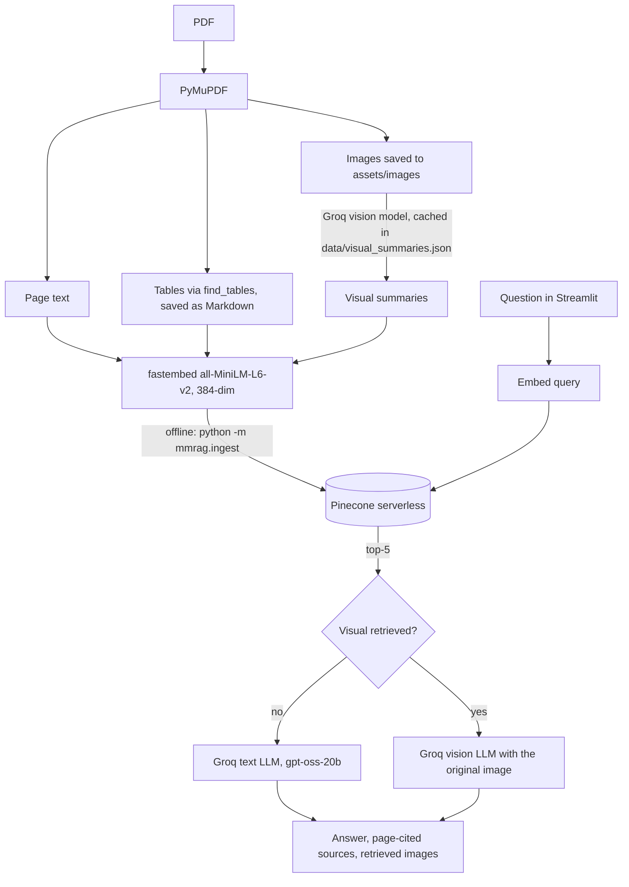

# Multimodal RAG: Chat with Text, Tables, Images & Graphs

Ask questions about a PDF whose answers live in **text, tables, charts and diagrams**. Every modality is turned into searchable text (Markdown for tables, vision-model summaries for images), embedded into **Pinecone**, and answered by **Groq** LLMs. When a chart or diagram is retrieved, the original image is sent to a vision model along with the text context.

**🔗 Live demo:** _coming soon_ <!-- TODO: add Render URL -->

<!-- TODO: add demo GIF, e.g.  -->

> ⏳ The demo runs on a free instance that sleeps when idle, so the first load can take 1–2 minutes.

---

## Why multimodal?

Real reports mix four modalities on the same page, and text-only RAG misses most of them:

| Modality | Example question (NovaCore FY2026 report) | Where the answer lives |
| :--- | :--- | :--- |
| 📄 Text | What does NovaCore do and where is it headquartered? | Narrative text (p. 1–2) |
| 📊 Table | Which region had the highest YoY revenue growth? | Regional table (p. 4): Europe, 31% |
| 📈 Graph | Which quarter had the highest revenue? | Line chart (p. 3): Q4 2026, about $37.5M |
| 🔀 Diagram | Where is the critical quality-control point? | Supply-chain diagram (p. 6): Quality Lab, Singapore |
| 🥧 Pie chart | What share of Penang electricity came from solar? | Pie chart (p. 8): 34% |
| 🖼️ Hybrid | Highest-margin product, and what does its image show? | Table + product image (p. 5): AtlasEdge X1, 46% |

## Architecture



- **Ingestion is offline.** You run it once from your machine. The web app only queries Pinecone.
- **Embeddings:** `sentence-transformers/all-MiniLM-L6-v2` through [fastembed](https://github.com/qdrant/fastembed) (ONNX, no PyTorch). The vectors match the sentence-transformers ones (cosine similarity 1.0), so an index built by the notebook still works.
- **Routing:** if any of the top-5 hits is a visual whose image exists in `assets/images/`, the vision model gets the context plus that image (one image per request). Otherwise the text model answers.
- **Models (all configurable through env vars):** `openai/gpt-oss-20b` (text), `qwen/qwen3.8-27b` (vision; it's a Groq *preview* model, so override `VISION_MODEL` if it gets retired).

## Project layout

```text
├── streamlit_app.py            # Streamlit UI (examples, sources table, images, rate limits)
├── mmrag/
│   ├── config.py               # env / st.secrets settings, model names
│   ├── embeddings.py           # fastembed MiniLM (384-dim, normalized)
│   ├── ingest.py               # offline PDF -> Pinecone (python -m mmrag.ingest)
│   ├── retriever.py            # direct Pinecone query (k=5), legacy image-path mapping
│   ├── router.py               # text vs vision routing
│   ├── answer.py               # prompts, Groq calls, answer cleanup
│   ├── vision.py, llm.py       # image -> data URI, Groq client
│   └── ratelimit.py            # question length + daily budget
├── assets/images/              # the 7 images extracted from the sample PDF
├── data/visual_summaries.json  # cached vision summaries (avoids repeat API calls)
├── notebooks/Multimodal_RAG.ipynb  # original step-by-step lecture notebook
├── tests/                      # pytest (no API keys needed)
├── NovaCore_Multimodal_Company_Report_2026.pdf          # synthetic sample report
├── Multimodal_RAG_LangChain_Pinecone_With_Examples.pdf  # lecture slides
├── render.yaml, Dockerfile     # deployment
└── .env.example
```

## Quickstart

Requires **Python 3.12**, a [Groq API key](https://console.groq.com/keys) and a [Pinecone API key](https://app.pinecone.io/) (the free Starter plan is enough).

```bash
git clone https://github.com/CodingWithSanjeet/multimodal-rag.git
cd multimodal-rag
cp .env.example .env        # then fill in GROQ_API_KEY and PINECONE_API_KEY
```

Pick one install method:

```bash
# uv (recommended)
uv sync

# or pip
python3.12 -m venv .venv && source .venv/bin/activate
pip install -r requirements.txt
```

### 1. Ingest (one time)

```bash
python -m mmrag.ingest --images-only   # extract images only (PyMuPDF, no API calls)
python -m mmrag.ingest --dry-run       # build all records, call the vision model only for uncached images
python -m mmrag.ingest                 # create the index if needed; upsert only if the namespace is empty
python -m mmrag.ingest --reset         # DELETE the namespace and re-index everything
```

Re-running is safe. Without `--reset`, a populated namespace is never touched. Summaries in `data/visual_summaries.json` are reused (6 of the 7 were recovered from the notebook's outputs). Add `--no-vision` to skip the vision API entirely.

### 2. Run the app

```bash
streamlit run streamlit_app.py
```

Or from the command line: `python -m mmrag.answer "Which region grew fastest?"`

### 3. Tests

```bash
uv run pytest      # or: pytest
```

## Deploy (Render free tier)

1. Push the repo to GitHub, then in Render choose **New > Blueprint** and select the repo (it reads `render.yaml`).
2. Set `GROQ_API_KEY` and `PINECONE_API_KEY` in the Render dashboard. They're never committed.
3. The build installs `requirements.txt` (CPU only, no torch/CUDA) and pre-downloads the ONNX MiniLM model (about 90 MB) into `.cache/fastembed`.
4. Start command: `streamlit run streamlit_app.py --server.port $PORT --server.address 0.0.0.0 --server.headless true`.

Notes:
- **Memory:** about 250 MB RSS measured locally with the model loaded and 3 sessions open, which fits Render's free 512 MB. The old torch + sentence-transformers stack peaked around 700 MB and didn't fit.
- **Cold start:** free services sleep after 15 minutes idle. Waking takes about 1 minute, plus Python imports and model load on 0.1 CPU.
- **Docker alternative:** `docker build -t multimodal-rag . && docker run -p 8501:8501 --env-file .env multimodal-rag`. Works on Render (Docker runtime), Koyeb, Fly.io, Railway.
- **Streamlit Community Cloud** also works: point it at `streamlit_app.py` and put the keys in its Secrets (read through `st.secrets`).

## Limits and cost

The public demo has guards so it can't burn API credits:

| Guard | Default | Env var |
| :--- | :--- | :--- |
| Max question length | 500 characters | – |
| New questions per browser session | 10 | `SESSION_QUESTION_LIMIT` |
| New questions per day (whole app) | 200 | `DAILY_QUESTION_LIMIT` |
| Example answers | cached 24 h (`st.cache_data`) | – |

- Limits are in-memory and reset when the instance restarts. That's fine for a demo, not a real quota system.
- Groq pricing (Oct 2026): gpt-oss-20b costs $0.075 / $0.30 per million tokens (input/output); qwen3.8-27b costs $0.80 / $4.00. Most questions retrieve at least one visual, so they use the vision model. Expect well under a cent per question.
- Use dedicated keys for the demo and set spend alerts in Groq and Pinecone.
- Pinecone Starter (free) easily covers 24 vectors.

## Notebook

[`notebooks/Multimodal_RAG.ipynb`](notebooks/Multimodal_RAG.ipynb) is the original lecture walkthrough (LangChain + sentence-transformers). It needs its own extras: `pip install langchain-core langchain-groq langchain-huggingface langchain-pinecone sentence-transformers ipython`.

## References & Acknowledgments
- Presentation and lecture concepts are based on *Multimodal RAG with LangChain & Pinecone* (DSwithBappy).
- Built with [PyMuPDF](https://pymupdf.readthedocs.io/), [fastembed](https://github.com/qdrant/fastembed), [Pinecone](https://www.pinecone.io/), [Groq](https://groq.com/) and [Streamlit](https://streamlit.io/).
- GitHub: [CodingWithSanjeet](https://github.com/CodingWithSanjeet)
